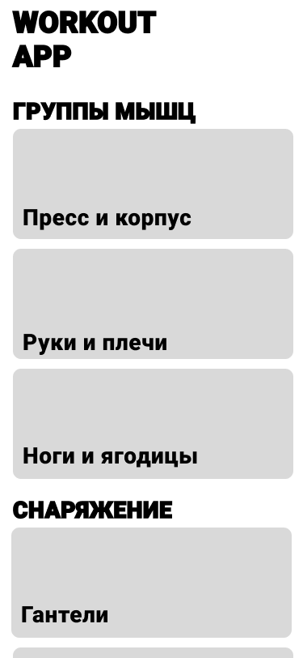
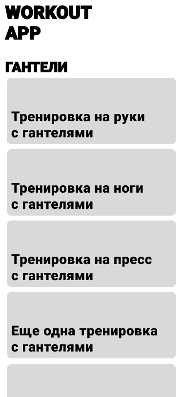
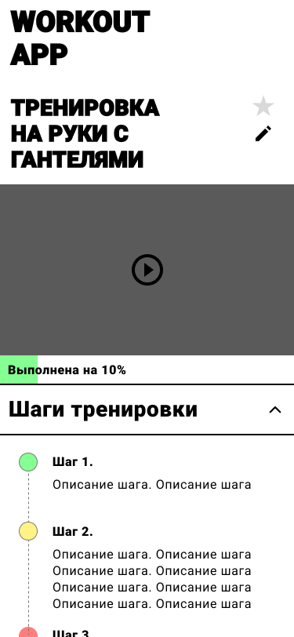

# 202212-ok-workoutapp

Выпускной проект курса [Otus Kotlin Backend developer](https://otus.ru/lessons/kotlin/?int_source=courses_catalog&int_term=programming).

Workout App -- это приложение, с помощью которого молодые IT-спекциалисты могут проводить 
функциональные тренировки дома или на свежем воздухе, используя минимально достпуное снаряжение.
Задача приложения -- сделать занятия спортом и здоровьем неотъемлемой и доступной частью жизни молодых IT-специалистов с небольшим доходом.

    
    
    

 - [Маркетинг приложения](docs/marketing.md)
 - [Функции (эндпоинты)](docs/endpoints.md)
 - [Описание сущностей](docs/entities.md)
 - [Архитектурная схема приложения](docs/architecture.md)