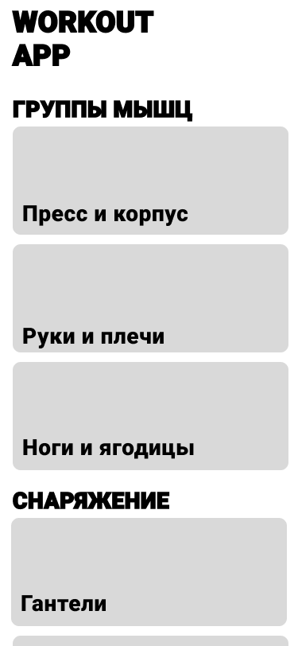
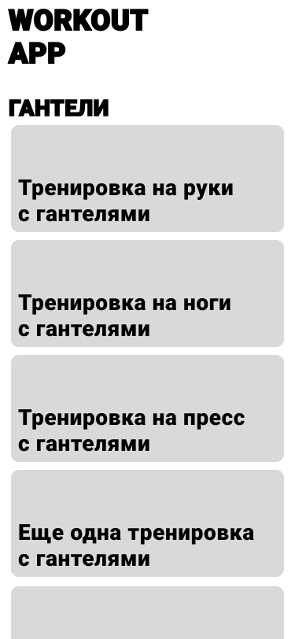

# 202212-ok-workoutapp

Выпускной проект курса [Otus Kotlin Backend developer](https://otus.ru/lessons/kotlin/?int_source=courses_catalog&int_term=programming).

Workout App -- это приложение, с помощью которого молодые IT-спекциалисты могут проводить 
функциональные тренировки дома или на свежем воздухе, используя минимально достпуное снаряжение.
Задача приложения -- сделать занятия спортом и здоровьем неотъемлемой и доступной частью жизни молодых IT-специалистов с небольшим доходом.

## Целевая аудитория 
It-специалисты начального уровня/стажеры -- разработчики, QA-инжененры, SRE, системные администраторы различных IT-компаний.
Небольшой доход не позволяет им приобрести абонемент в фитнес-клуб, а многие компании не предоставляют этот бонус
начинающим специалистам. 

## Гипотетический портрет пользователя
1. It-специалист начального уровня или стажер (0-2 лет опыта работы в индустрии)
2. Мужчина/женщина - 18 - 25 лет, без брака и детей
3. Учится в вузе или недавний выпускник
4. Доход меньше 100000 рублей
5. Как правило, живет в съемном жилье/с родителями/в студенческом общежитии.

## Описание MVP

    
    

