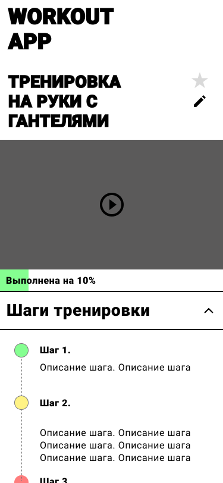

# 202212-ok-workoutapp

Выпускной проект курса [Otus Kotlin Backend developer](https://otus.ru/lessons/kotlin/?int_source=courses_catalog&int_term=programming).

Workout App -- это приложение, с помощью которого молодые IT-спекциалисты могут проводить 
функциональные тренировки дома или на свежем воздухе, используя минимально достпуное снаряжение.
Задача приложения -- сделать занятия спортом и здоровьем неотъемлемой и доступной частью жизни молодых IT-специалистов с небольшим доходом.

## Целевая аудитория 
It-специалисты начального уровня/стажеры -- разработчики, QA-инжененры, SRE, системные администраторы различных IT-компаний.
Небольшой доход не позволяет им приобрести абонемент в фитнес-клуб, а многие компании не предоставляют этот бонус
начинающим специалистам. 

## Гипотетический портрет пользователя
1. It-специалист начального уровня или стажер (0-2 лет опыта работы в индустрии)
2. Мужчина/женщина - 18 - 25 лет, без брака и детей
3. Учится в вузе или недавний выпускник
4. Доход меньше 100000 рублей
5. Как правило, живет в съемном жилье/с родителями/в студенческом общежитии.

## Описание MVP
MVP представляет собой мобильное приложение, 
с набором тренировок, сгруппированным по трем групам мышц, а также 

    
    
    

### Функции (эндпоинты)

1. workouts - тренировки
   create - создается модератором
   read
   update

2. feedback
   read
   create - отправить отзыв
   update - изменить отзыв, изменить оценку, добавить фото
   delete

### Описание сущностей 

#### Workout
 - Title - название тренировки
 - Description - краткое описание тренировки
 - Type - тип тренировки [WorkoutType](#WorkoutType)
 - Equipment - оборудование для тренировки [Equipment](#Equipment)
 - Content 
   - video - видеоматериал тренировки (строка с URL видео)
   - steps - текстовое описание шагов тренировки - массив [WorkoutStep](#WorkoutStep) 
 - Feedback - [Feedback](#Feedback)
 - Rating - общая оценка тренировки (Double)

#### WorkoutStep
 - Title - название шага
 - Description - текстовое описание шага

#### Feedback
 - Review - отзыв пользователя (Текст комментария)
 - Rating - оценка пользователя

#### WorkoutType
 Enum. Тип тренировки по группе мышц.
 - Core - пресс и корпус
 - Arms - руки и плечи
 - Legs - ноги и ягодицы

#### Equipment
 Enum. Оборудование для тренировки.
 - OwnWeight - собственный вес
 - Dumbbells - гантели
 - JumpingRope - скакалка
 - HorizontalBar - турник
 - Bars - брусья